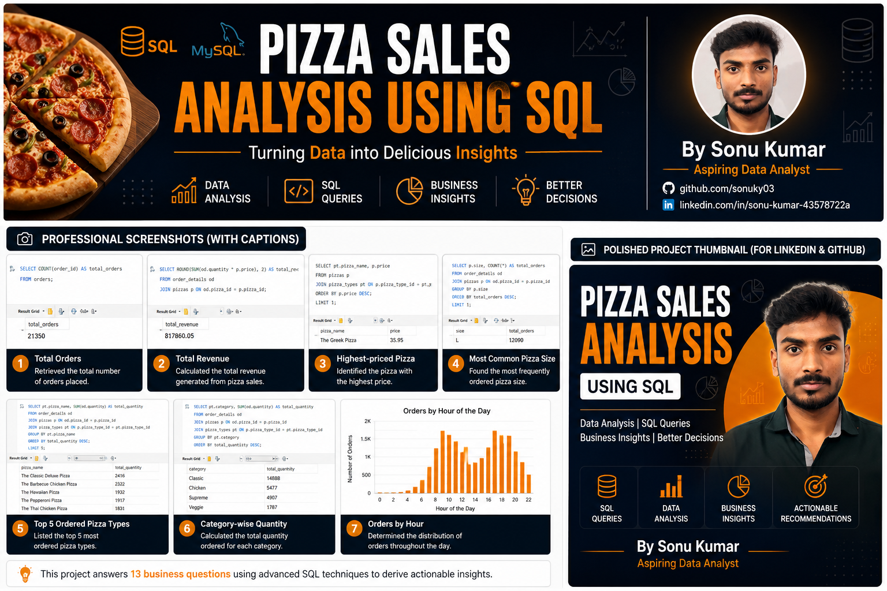

<p align="center">
  
</p>

<h1 align="center">🍕 Pizza Sales Analysis Using SQL</h1>

<p align="center">
A complete SQL portfolio project that analyzes pizza sales data to uncover business insights and support data-driven decision-making.
</p>

<p align="center">
  
  
  
  
</p>

---

# 📌 Project Overview

This project analyzes pizza sales data using **MySQL** to answer real-world business questions. The objective is to uncover valuable insights related to sales performance, customer ordering behavior, revenue generation, and product popularity.

---

# 🎯 Objectives

- Analyze overall sales performance
- Identify top-performing pizzas
- Understand customer ordering patterns
- Generate business insights using SQL
- Practice advanced SQL concepts

---

# 🛠️ Tools & Technologies

- SQL
- MySQL
- MySQL Workbench
- Git & GitHub

---

# 📂 Dataset

| Table | Description |
|--------|-------------|
| Orders | Stores order date and time |
| Order_Details | Stores purchased pizzas |
| Pizzas | Pizza size and price |
| Pizza_Types | Pizza names and categories |

---

# 🗂 Database Schema

```text
Orders
   │
   ▼
Order_Details
   │
   ▼
Pizzas
   │
   ▼
Pizza_Types
```

---

# 📊 Business Questions Solved

## Basic
- Retrieve total number of orders
- Calculate total revenue
- Highest-priced pizza
- Most common pizza size
- Top 5 ordered pizza types

## Intermediate
- Category-wise quantity
- Orders by hour
- Category distribution
- Average pizzas ordered per day
- Top 3 pizzas by revenue

## Advanced
- Revenue contribution by category
- Cumulative revenue
- Top 3 pizzas by revenue within each category

---

# 💡 SQL Concepts Used

- INNER JOIN
- GROUP BY
- ORDER BY
- Aggregate Functions
- Subqueries
- Window Functions
- CTEs
- Ranking Functions

---

# 📈 Key Insights

- **21,350** total customer orders
- **$817,860.05** total revenue
- Large pizzas were the most ordered
- Peak demand during lunch and evening
- Premium pizzas generated high revenue

---

# 📁 Repository Structure

```text
Pizza-Sales-SQL-Analysis/
├── Dataset/
├── SQL Queries/
├── Presentation/
├── Images/
└── README.md
```

---

# 🚀 How to Run

1. Import CSV files into MySQL.
2. Create the required tables.
3. Execute the SQL script.
4. Review the results.

---

# 🎓 Skills Demonstrated

- SQL Query Writing
- Data Analysis
- Relational Databases
- Business Intelligence
- Problem Solving

---

# 👨‍💻 About Me

**Sonu Kumar**  
**Aspiring Data Analyst**

📧 Email: kumarsonu975999@gmail.com

🔗 LinkedIn: https://www.linkedin.com/in/sonu-kumar-43578722a/

💻 GitHub: https://github.com/sonuky03

---

## ⭐ If you like this project, don't forget to give it a Star!
